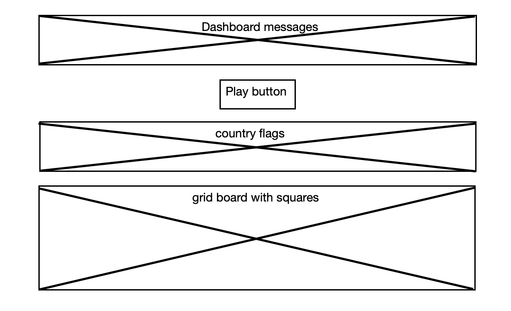

## Game Title

Guess the flags of world drag and drop board game.

## Game Description/Objective

Drag and drop each country flag onto the correct grid board square.

## Game Rules

A player needs to drag and drop each of the randomly displayed country flags onto the game board square displaying the correct country name. A player needs to correctly complete the game before the countdown timer reaches zero.

## User Story

As a player:

- I want to start the game to display the randomised country flags and country names in the game board squares.
- I want the flags to be displayed in a different order to the names of the corresponding countries in the grid board squares.
- I want to be able to drag and drop a flag onto the correct square on the board.
- I do not want to be able to drop a flag onto the incorrect square on the board.
- I want to see how much time I have left remaining during the game in play.
- I want to see a correct or incorrect message after I make a drop move.
- I want to be able to see a score of how many flags I have correctly dropped during the game.
- I want to see a congratulations message if I successfully complete the game.
- I want to see a game over message if the game is not completed within the allotted time.
- I do not want to be able to drag flags when the countdown timer reaches zero.
- I want to be able to start a new game when the current game is over.
- I want the the flags to be randomly chosen each time I play a new game, so it is different to the previous game.

## Wireframe

## Technologies

- HTML
- CSS
- JavaScript
- flagpedia.net data

## Future Developments

- Add progressively more difficult levels, where the flags get harder (the game starts with the most common/major nation flags and increasingly shows less widely recognised/smaller nation flags) and the time to complete the game gets shorter.
